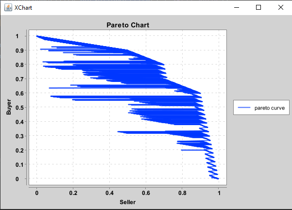

# Pareto chart in Bilateral Negotiation game

This program wants to draw a Pareto chart of below table:

| Decision variable |    scope   | min | max | seller weight | buyer weight |
|:-----------------:|:----------:|:---:|:---:|:-------------:|:------------:|
| Price             | [100, 900] | 100 | 900 | 0.5           | 0.1          |
| warranty duration | [0, 36]    | 0   | 36  | 0.2           | 0.1          |
| send duration     | [1, 21]    | 1   | 21  | 0.1           | 0.6          |
| product return    | {yes, no}  |     |     | 0.2           | 0.2          |

## Output chart

